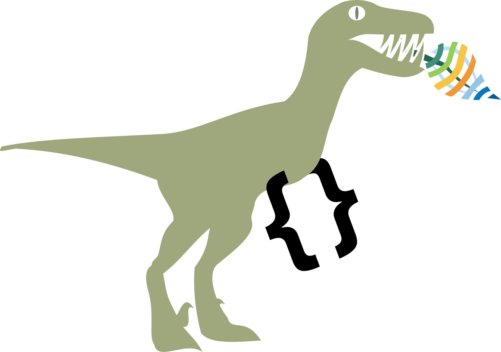

<!-- README.md is generated from README.Rmd. Please edit that file -->

```{r, include = FALSE}
knitr::opts_chunk$set(
  collapse = TRUE,
  comment = "#>",
  fig.path = "man/figures/README-",
  out.width = "100%"
)
```

validiraptor

<!-- badges: start -->
<!-- badges: end -->

# pkgdown 

Validiraptor launches a web app for the validation of data structures using JSON schema.

## Installation

You can install the development version of validiraptor like so:

``` r
remotes::install_github("eLTER-RI/validiraptor")
```

## Example

To launch the app locally:
```
library(validiraptor)
run_app()
```

To launch the documentation in your browser:
```
run_site()
```

## Sponsors
This app was developed with funding from [**eLTER** PLUS](https://elter-ri.eu/elter-plus) and [BioDT](https://biodt.eu/).

